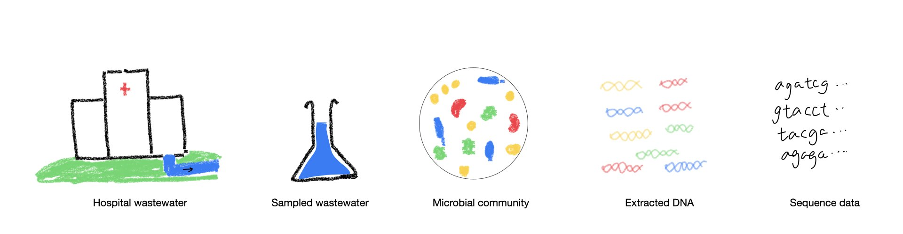
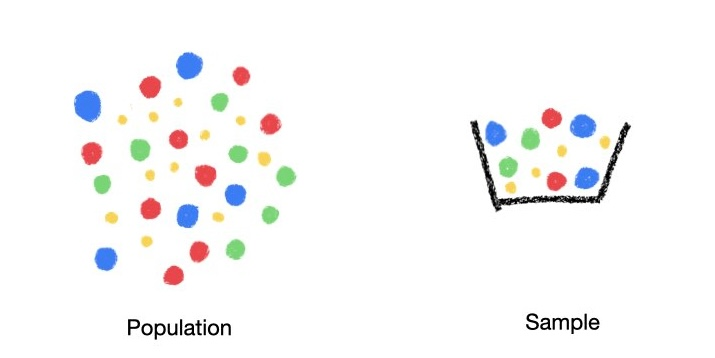

# Metagenomics and the data generation process

## What is metagenomics?
For the purposes of this workshop, we define metagenomics as the application of high-throughput sequencing to DNA extracted directly from environmental, uncultured samples. 
For example, later we will be looking at samples of microbial community found in hospital waste water.

## From samples to sequences
The figure below shows how we go from environment samples, in this case hospital wastewater, to seqeunce data.

Metagenomic sampling produces a lot of sequence data, which is the starting point of bioinformatics analysis.

## How the statistician sees it
Metagenomics data is compositional data.

There is meaning only in the relative abundances observed in the sample.

## Discussion
Are you planning to use metagenomics for your study?
What is the experiment design?

## Further reading
- Gkiir et al, [Microbiome Datasets Are Compositional: And This is Not Optional](https://doi.org/10.3389/fmicb.2017.02224), Front. Microbiol.,2017. 
